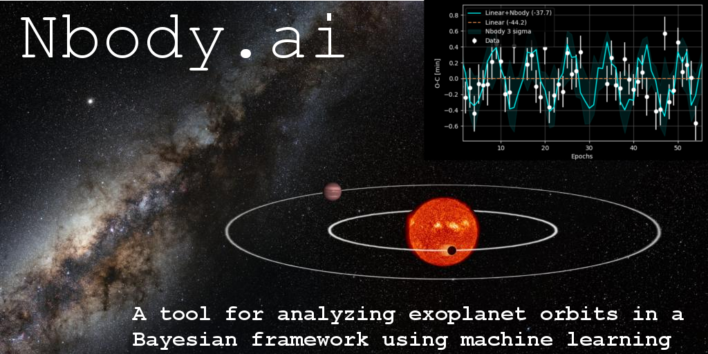
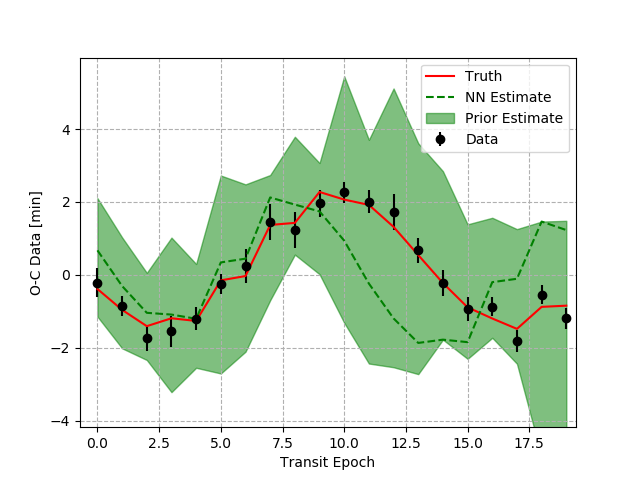
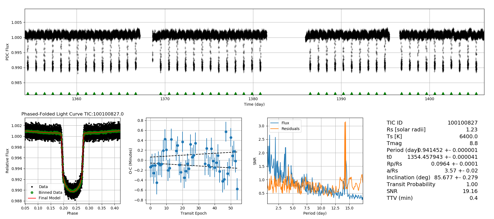
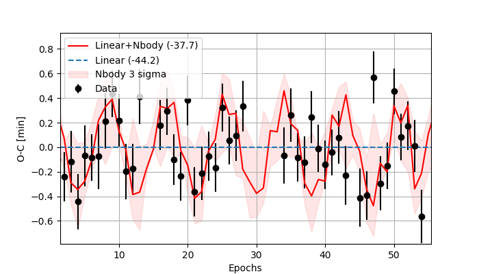

# N-Body AI Retrieval
A python 3 package for generating N-body simulations, computing transit timing variations (TTV) and retrieving orbit parameters and uncertainties from TTV measurements within a Bayesian framework. Machine learning is used to estimate the orbit parameters and constrain priors before running a retrieval to model orbital perturbations. 



## Background
Transiting exoplanets in multiplanet systems exhibit non-Keplerian orbits as a result of the graviational influence from companions which can cause the times and durations of transits to vary (TTV/TDV). The amplitude and periodicity of transit time variations are characteristic of the perturbing planet's mass and orbit. Astronomers back in the day were able to measure orbital perturbations of Uranus in order to indirectly discover Neptune before it was seen through a telescope. A similar analysis can be used to find planets outside of our solar system.


Video credit: [NASA](https://www.youtube.com/watch?v=rqQ1xKsNIQE)

## Generate an N-body simulation 
The n-body simulations in this research make use of the [REBOUND](https://rebound.readthedocs.io) code. To generate a random simulation follow the code below: 
```python
from nbody.simulation import generate, analyze, report
from nbody.tools import mjup,msun,mearth

if __name__ == "__main__":
    
    # units: Msun, Days, au
    objects = [
        {'m':1.12},
        {'m':0.28*mjup/msun, 'P':3.2888, 'inc':3.14159/2, 'e':0, 'omega':0  }, 
        {'m':0.988*mjup/msun, 'P':7, 'inc':3.14159/2, 'e':0,  'omega':0  }, 
        {'m':0.432*mjup/msun, 'P':12, 'inc':3.14159/2, 'e':0,  'omega':0  }, 
    ]

    # create REBOUND simulation
    # year long integrations, timestep = 1 hour
    sim_data = generate(objects, 365, 365*24)

    # collect the analytics of interest from the simulation
    ttv_data = analyze(sim_data)

    # plot the results 
    report(ttv_data, savefile='report.png')
```
A simulation report looks like this: 

**Top Left** plots of the orbit positions for each object. **Top Middle** Radial velocity semi-amplitude (m/s) for the star. **Top Right** Lomb-Scargle periodogram of the RV semi-amplitude signal. **Bottom Left** Table of simulation parameters. **Bottom Middle** The difference (or residuals) between the observed transit times and a calculated linear ephemeris (O-C). **Bottom Right** Lomb-Scargle periodogram of the O-C signal for each planet. 

The data product for each simulation returned by `analyze(...)` will look like: 
```python
ttv_data = {
    'mstar': float,     # mass of star (msun)
    'objects': dict,    # dictionary passed to generate() simulation method 
    'times': ndarray,   # array of each time in simulation 

    'RV':{
        'signal': ndarray, # RV semi-amplitude signal as a function of time (m/s)
        'max': float        # average between maximum and 75% percentile of |RV semi-amplitude| (m/s)

        'freq': ndarray,    # frequencys in periodogram (1./day)
        'power': ndarray,   # periodogram power from Lomb Scargle routine
    },

    'planets':[  # list of planet parameter dictionaries 
        {
            # orbit parameters
            'm': float,    # mass of planet in msun
            'a': float,    # average semi-major axis of simulation orbits (au)
            'e': float,    # average eccentricity of simulation orbits
            'inc': float,  # average inclination from simulation orbits
            'x': ndarray,  # downsampled orbit positions (1/10 resolution, au)
            'y': ndarray,  # downsampled orbit positions (1/10 resolution, au)

            # transit time data 
            'P': float,      # period derived from linear fit to mid transit times (day)
            't0': float,     # 0th epoch transit time from linear fit to mid transit times (day)
            'tt': ndarray,   # mid-transit times (day)
            'ttv': ndarray,  # o-c values (linear ephemeris subtracted from tt) (day)
            'max': float     # average between maximum and 75% percentile of |O-C| signal (min)

            # periodogram data of o-c signal 
            'freq': ndarray,    # frequencys in periodogram (1./epoch)
            'power': ndarray,   # periodogram power from Lomb Scargle routine
        }
    ]
}
```

## Estimating Planet Orbits
The presence of additional planets or moons in an exoplanet system can be inferred by measuring perturbations in the orbit of a transiting exoplanet. The gravitational influence from a campanion, even if it is non-transiting, can perturb the transiting planet in a manner characteristic to the orbit of the perturbing planet. An N-body retrieval with nested sampling is used to derive the best orbit parameters and uncertainties. 

See documentation for [N-body retrieval](Retrieval.md). 


## Machine learning
Retrieving orbit parameters and uncertainties typically takes ~5000 N-body simulations or more. N-body simulations can take up to a few minutes to an hour EACH depending on how long the integration is. Machine learning is leveraged to expedite our retrieval by estimating the orbit parameters and constraining the prior parameter distribution. Constraining the prior means the retrieval takes less time to run. Specificially, a fully connected neural network is used to map O-C data along with M*, M1, P1 to the orbit parameters of a companion; M2, P2, e2 and omega2. 

See documentation for [machine learning](simulations/)




## Science
The plot below is a time series analysis for the object WASP-18 b using data from the [Transiting Exoplanet Survey Satellite](https://www.nasa.gov/tess-transiting-exoplanet-survey-satellite/). The top subplot shows a full timeseries of data from sectors 1–2 with the mid transit of each light curve plotted as a green triangle. The bottom left subplot shows a phase folded light curve that has been fit with a transit model to derive the planetary parameters shown in the table on the far right. The green data points are phase folded and binned to a cadence of 2 minutes. The dotted line in the O-C plot represents one sigma uncertainties on the linear ephemeris. The middle right subplot shows a transit periodogram for the PDC Flux and for the residuals of the time series after each light curve has been removed



The residuals of a linear ephemeris are plotted and then compared against a non-linear ephemeris computed from an N-body simulation in the figure below. The values in the legend indicate the Bayesian evidence output from MultiNest with the non-linear model having a greater evidence than the linear model suggesting there is a significant perturbation in the transit times. We attribute this perturbation to be due to another planet in the system which contradicts [recent analyses](https://arxiv.org/abs/1811.06020) of this system. 



## Citation 
This work has been submitted for publication in Nature Astronomy and is currently under review. A preprint is available [here](https://www.overleaf.com/read/mfqvfxjbfrwh) and comments from the community are welcome. 

If you use any of these algorithms in your work please include Kyle A. Pearson as a coauthor. Current institution: Lunar and Planetary Laboratory, University of Arizona, 1629 East University Boulevard, Tucson, AZ, 85721, USA