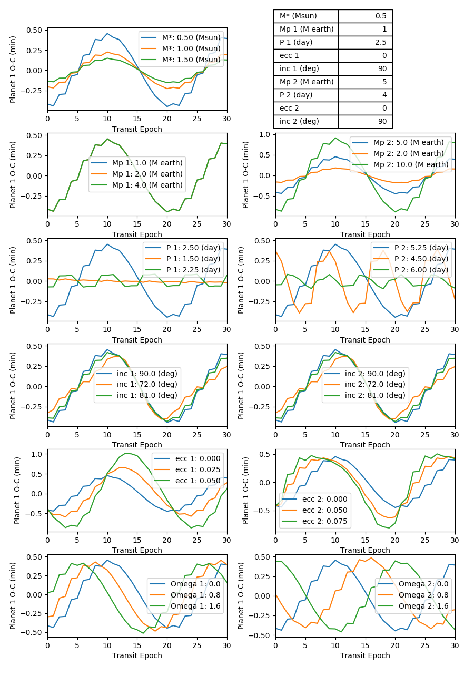

# N-Body TTV Retrieval
A python 3 package for generating N-body simulations, computing transit timing variations (TTV) and retrieving orbit parameters and uncertainties from TTV measurements within a Bayesian framework.

## Background
Transiting exoplanets in multiplanet systems exhibit non-Keplerian orbits as a result of the graviational influence from companions which can cause the times and durations of transits to vary (TTV/TDV). The amplitude and periodicity of the transit time variations are characteristic of the perturbing planet's mass and orbit. 

## Generate an N-body simulation 
The n-body simulations in this research make use of the [REBOUND](https://rebound.readthedocs.io) code. To generate a random simulation follow the code below: 
```python
from nbody.simulation import generate, analyze, report
from nbody.tools import mjup,msun,mearth

if __name__ == "__main__":
    
    # units: Msun, Days, au
    objects = [
        {'m':1.12},
        {'m':0.28*mjup/msun, 'P':3.2888, 'inc':3.14159/2, 'e':0, 'omega':0  }, 
        {'m':0.988*mjup/msun, 'P':7, 'inc':3.14159/2, 'e':0,  'omega':0  }, 
        {'m':0.432*mjup/msun, 'P':12, 'inc':3.14159/2, 'e':0,  'omega':0  }, 
    ]

    # create REBOUND simulation
    # year long integrations, timestep = 1 hour
    sim_data = generate(objects, 365, 365*24)

    # collect the analytics of interest from the simulation
    ttv_data = analyze(sim_data)

    # plot the results 
    report(ttv_data, savefile='report.png')
```
An example simulation report looks like this: 

**Top Left** plots of the orbit positions for each object. **Top Middle** Radial velocity semi-amplitude (m/s) for the star. **Top Right** Periodogram of RV semi-amplitude signal. **Bottom Left** Table of simulation parameters. **Bottom Middle** The difference between the observed transit time and calculated linear ephemeris (O-C). **Bottom Right** Periodogram of O-C signal for each planet. 

The data product for each simulation returned by `analyze(...)` will look like: 
```python
ttv_data = {
    'mstar': float,     # mass of star (msun)
    'objects': dict,    # dictionary passed to generate_simulation(...) method 
    'times': ndarray,   # array of each time in simulation 

    'RV':{
        'signal': ndarray, # RV semi-amplitude signal as a function of time (m/s)
        'max': float        # average between maximum and 75% percentile of RV semi-amplitude (m/s)

        'freq': ndarray,    # frequencys in periodogram (1./day)
        'power': ndarray,   # periodogram power from Lomb Scargle routine
    },

    'planets':[  # list of planet parameter dictionaries 
        {
            # orbit parameters
            'm': float,    # mass of planet in msun
            'a': float,    # average semi-major axis of simulation orbits (au)
            'e': float,    # average eccentricity of simulation orbits
            'inc': float,  # average inclination from simulation orbits
            'x': ndarray,  # downsampled orbit positions (1/10 resolution, au)
            'y': ndarray,  # downsampled orbit positions (1/10 resolution, au)

            # transit time data 
            'P': float,      # period derived from linear fit to mid transit times (day)
            't0': float,     # 0th epoch transit time from linear fit to mid transit times (day)
            'tt': ndarray,   # mid-transit times (day)
            'ttv': ndarray,  # o-c values (linear ephemeris subtracted from tt) (day)
            'max': float     # average between maximum and 75% percentile of O-C signal (min)

            # periodogram data of o-c signal 
            'freq': ndarray,    # frequencys in periodogram (1./epoch)
            'power': ndarray,   # periodogram power from Lomb Scargle routine
        }
    ]
}
```

## Estimating Planet Orbits
The presence of additional planets or even moons in an exoplanet system can be inferred by measuring perturbations in the orbit of a transiting exoplanet. The gravitational influence from the campanion, even if it is non-transiting, can perturb the transiting planet in a manner characteristic to the orbit of the perturbing planet. The plot below shows how each parameter in a planetary system can impact our measured transit time.




## Citation 
If you use any of these algorithms in your work please include Kyle A. Pearson as a coauthor. Current institution: Lunar and Planetary Laboratory, University of Arizona, 1629 East University Boulevard, Tucson, AZ, 85721, USA

## Future updates
- Documentation for retrieval
- implement RV fitting to reduce degeneracies
- include multiple O-C signals for simulatenous retrieval of planet 1 + 2 mass
- use NN or clustering technique to estimate priors from simulation archive