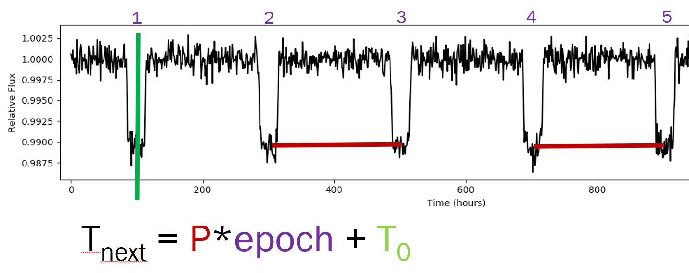
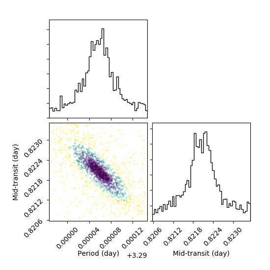
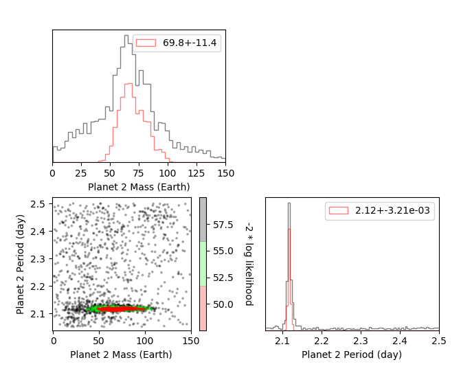
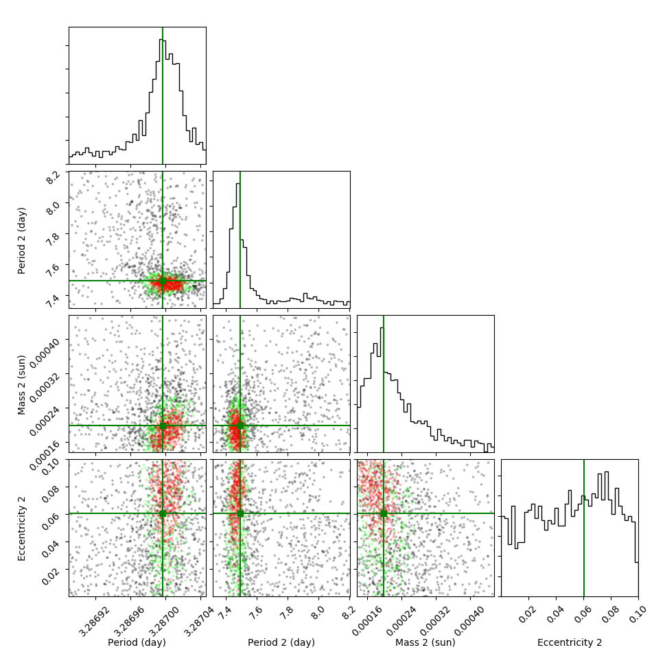

## Getting started

Requirements
1. Planetary Parameters (M*, M1, P1)
2. Mid transit values (or light curves)

If you have a bunch of light curve and no mid transit values see the [exoplanet light curve analysis repo](https://github.com/pearsonkyle/Exoplanet-Light-Curve-Analysis) in order to model a light curve.

## Linear Ephemeris 
Orbital periods for exoplanets are defined by their periodic motion around a star using a linear function. The transit time for an exoplanet can be modelled as the function: 


Where P is the orbital period, t0 is the epoch of mid transit, epoch is the number of transits between t0 and t_next. 

Fitting orbital periods can be done very quickly using a linear least squares fit
```python
def TTV(epochs, tt):
    N = len(epochs)
    A = np.vstack([np.ones(N), epochs]).T
    b, m = np.linalg.lstsq(A, tt, rcond=None)[0]
    ttv = (tt-m*np.array(epochs)-b)
    return [ttv,m,b]
```

However, we often want uncertainties or in this case a Bayesian evidence value so we can assess the signficance of any perturbations in the residuals of our fit. The file [`l_fit.py`](l_fit.py) will perform a linear fit using nested sampling to any input file as long as your specify an initial guess 
```
python l_fit.py -i sim_data.txt -m 3 -b 1
```

outputs from the linear fit should something like this since they come from the [pymultinest library](https://johannesbuchner.github.io/PyMultiNest/_modules/pymultinest/analyse.html)
```python
{'global evidence': -28.16478984960665,
 'global evidence error': 0.02244189768110352,
 'marginals': [{'1sigma': [3.290038651107733, 3.290076047008608],
                '2sigma': [3.290020254447641, 3.290092827107199],
                '3sigma': [3.290001950310322, 3.290112353912994],
                '5sigma': [3.2899658954170388, 3.2901465708769426],
                'median': 3.290057036072514,
                'q01%': 3.290014376800162,
                'q10%': 3.290033253426363,
                'q25%': 3.2900450856794383,
                'q75%': 3.290069748919135,
                'q90%': 3.290080937095308,
                'q99%': 3.2901005427836454,
                'sigma': 1.869795043751843e-05},
               {'1sigma': [0.8217712276436251, 0.822358714420993],
                '2sigma': [0.8215156073831965, 0.8226391675519908],
                '3sigma': [0.8211735200124383, 0.8229650755411498],
                '5sigma': [0.8205894543626013, 0.8235565418600492],
                'median': 0.8220648814225097,
                'q01%': 0.8214035249086015,
                'q10%': 0.8216869702160987,
                'q25%': 0.8218532236408213,
                'q75%': 0.8222565430203911,
                'q90%': 0.8224394451853884,
                'q99%': 0.8227250359454497,
                'sigma': 0.00029374338868393135}],
 'modes': [{'index': 0,
            'local log-evidence': -28.16478984960665,
            'local log-evidence error': 0.02244189768110352,
            'maximum': [3.290058315283389, 0.8220461642762776],
            'maximum a posterior': [3.2900786139976814, 0.8219269244895189],
            'mean': [3.2900571665294143, 0.822061412683475],
            'sigma': [1.8356295273070617e-05, 0.00029263127685737655],
            'strictly local log-evidence': -28.16478984960665,
            'strictly local log-evidence error': 0.02244189768110352}],
 'nested importance sampling global log-evidence': -28.16478984960665,
 'nested importance sampling global log-evidence error': 0.02244189768110352,
 'nested sampling global log-evidence': -28.36049634744804,
 'nested sampling global log-evidence error': 0.21417949940030861}
```


The colors are coordinated to the fit percentile with darker colors indicating better fits. 

The command line interface for performing a linear fit to a file of data:
```
usage: l_fit.py [-h] [-i INPUT] [-m SLOPE] [-b YINT]

optional arguments:
  -h, --help            show this help message and exit
  -i INPUT, --input INPUT
                        Input file with 3 columns of data (x,y,yerr)
  -m SLOPE, --slope SLOPE
                        slope prior
  -b YINT, --yint YINT  y-intercept prior
```
## Nonlinear Ephemeris 
The residuals of a linear fit are used to search for perturbations in the orbit that might indicate the presence of another planet
```
usage: nl_fit.py [-h] [-i INPUT] [-ms MSTAR] [-t TMID] [-m1 MASS1]
                 [-p1 PERIOD1] [-m2 MASS2] [-p2 PERIOD2] [-o2 OMEGA2]
                 [-e2 ECCENTRICITY2] [-ml AI]

optional arguments:
  -h, --help            show this help message and exit
  -i INPUT, --input INPUT
                        Input file with 3 columns of data (x,y,yerr) 
  -ms MSTAR, --mstar MSTAR
                        stellar mass
  -t TMID, --tmid TMID  mid transit prior
  -m1 MASS1, --mass1 MASS1
                        planet 1 mass (earth)
  -p1 PERIOD1, --period1 PERIOD1
                        planet 1 period (earth)
  -m2 MASS2, --mass2 MASS2
                        planet 2 mass prior (earth)
  -p2 PERIOD2, --period2 PERIOD2
                        planet 2 period prior (day)
  -o2 OMEGA2, --omega2 OMEGA2
                        planet 2 omega prior (radian)
  -e2 ECCENTRICITY2, --eccentricity2 ECCENTRICITY2
                        planet 2 eccentricity prior (radian)
  -ml AI, --ai AI       machine learning prior estimate
```
```
python nl_fit.py -i transittimes.txt -ms 1.12 -m1 3000
```
The transit times are modeled for WASP-18 b using an N-body simulation. The Bayesian evidence for a non-linear ephemeris is larger than a linear ephemeris suggesting our model with an 3 planets is a better fit than a 2 body system. 


Posteriors for the fit will looks like this:



## Validation 
Retrieval results from a simulated data set




See file `nested_nbody.py`

## Things to improve
- implement RV fitting to reduce degeneracies
- include multiple O-C signals for simulatenous retrieval of planet 1 + 2 mass